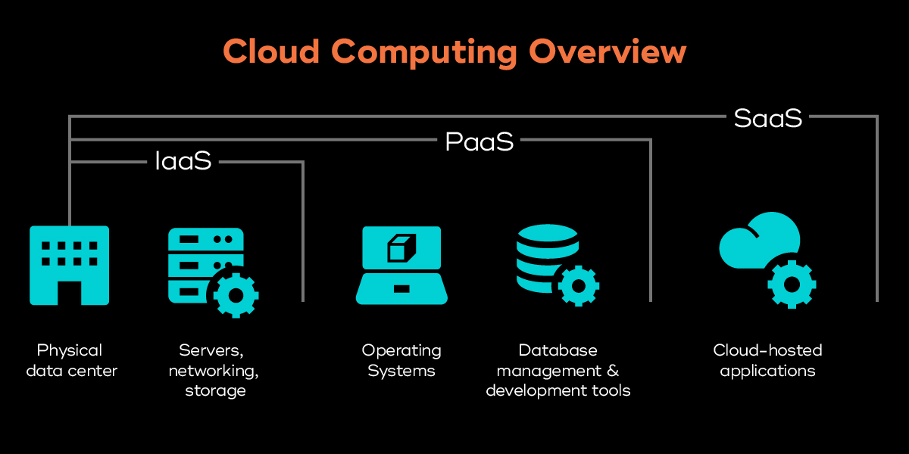

# Infrastructure as a Service

* IaaS ist ein Cloud Computing-Modell, das Server, Speicher und Netzwerke bedarfsgesteuert bereitstellt, ohne dass physische Hardware erforderlich ist.
* IaaS liefert virtualisierte Computingressourcen, die in Rechenzentren von Cloudanbietern gehostet und über eine Weboberfläche oder API abgerufen werden.
* Unternehmen können Ressourcen nach Bedarf skalieren und zahlen nur für das, was sie nutzen, wodurch Kosten gesenkt werden und die 
* Flexibilität verbessert wird.
* IaaS ermöglicht eine schnelle Anwendungsbereitstellung, indem die Notwendigkeit für Hardwareverwaltung entfällt und die
* IT-Infrastruktur vereinfacht wird.
* Zu den Vorteilen gehören reduzierte Kosten, flexible Skalierung und schnellere Bereitstellung.
* IaaS wird für Migration, Entwicklung, Speicherung, Web-Apps, High Performance Computing und Big Data-Analysen verwendet.
* IaaS entwickelt sich mit Trends wie KI-gesteuerter Automatisierung, Edge-Computing und umweltfreundlicher Infrastruktur weiter.

**IaaS stellt virtualisierte IT-Ressourcen flexibel und kosteneffizient bereit, vereinfacht die Infrastruktur und entwickelt sich mit Automatisierung, Edge-Computing und Nachhaltigkeit weiter. Es ist auch die Grundlage, für Cloudcomputing**

