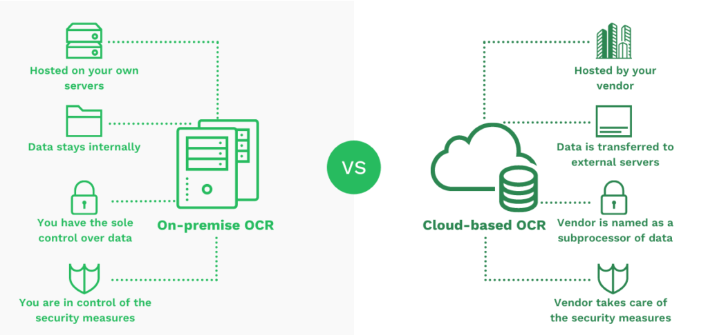

# OnPremise

* On-Premise bezeichnet ein Bereitstellungsmodell, bei dem Hard- und Software im eigenen Unternehmen betrieben und verwaltet werden.
* Die Verantwortung für Infrastruktur, Wartung, Updates und Sicherheit liegt vollständig bei der internen IT.
* Vorteile sind volle Kontrolle, Datensouveränität und die Möglichkeit, individuelle Anpassungen vorzunehmen.

**On-Premise bedeutet, dass Unternehmen ihre IT-Infrastruktur selbst betreiben und verwalten, wodurch sie volle Kontrolle und Datensouveränität erhalten.**

