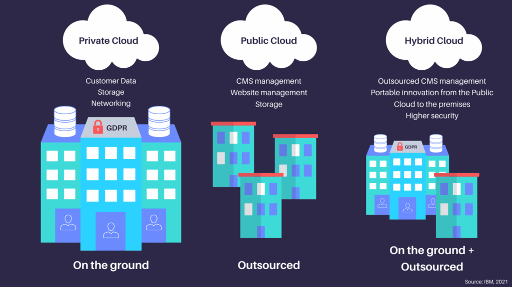

# Private Cloud

* Private Cloud ist ein Cloud-Modell, das ausschliesslich von einem einzelnen Unternehmen oder einer Organisation genutzt wird.
* Die Infrastruktur kann im eigenen Rechenzentrum oder von einem externen Anbieter betrieben werden, bleibt aber exklusiv.
* Vorteile sind hohe Kontrolle, Sicherheit und individuelle Anpassbarkeit.

**Die Private Cloud bietet eine exklusive Cloud-Umgebung mit hoher Kontrolle und Sicherheit für ein Unternehmen.**

# Public Cloud

* Public Cloud ist ein Cloud-Modell, bei dem Ressourcen (Rechenleistung, Speicher, Anwendungen) über das Internet von einem externen Provider bereitgestellt werden.
* Mehrere Kunden teilen sich die Infrastruktur, die nach Bedarf skaliert werden kann.
* Vorteile sind Kosteneffizienz, Flexibilität und schnelle Skalierbarkeit.

**Die Public Cloud stellt IT-Ressourcen über das Internet bereit und ermöglicht flexible, kosteneffiziente Skalierung.**

# Hybrid Cloud

* Hybrid Cloud kombiniert Private und Public Cloud zu einer integrierten Lösung.
* Unternehmen können sensible Daten in der Private Cloud sichern, während skalierbare Ressourcen aus der Public Cloud genutzt werden.
* Vorteile sind Flexibilität, Skalierbarkeit und ein optimiertes Kosten-Nutzen-Verhältnis.

**Die Hybrid Cloud verbindet Private und Public Cloud, um Sicherheit, Flexibilität und Kostenoptimierung zu vereinen.**

